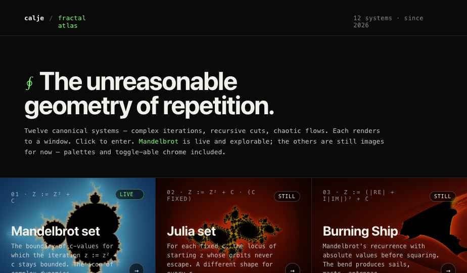
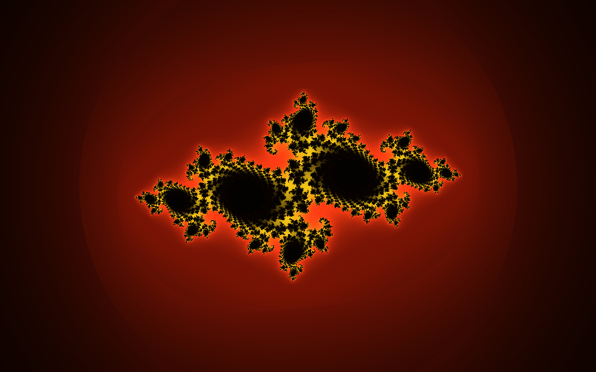
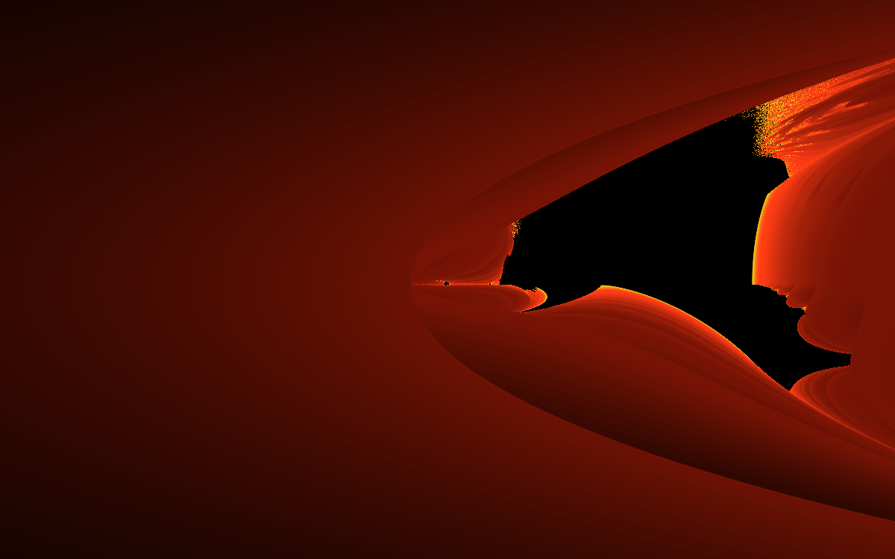
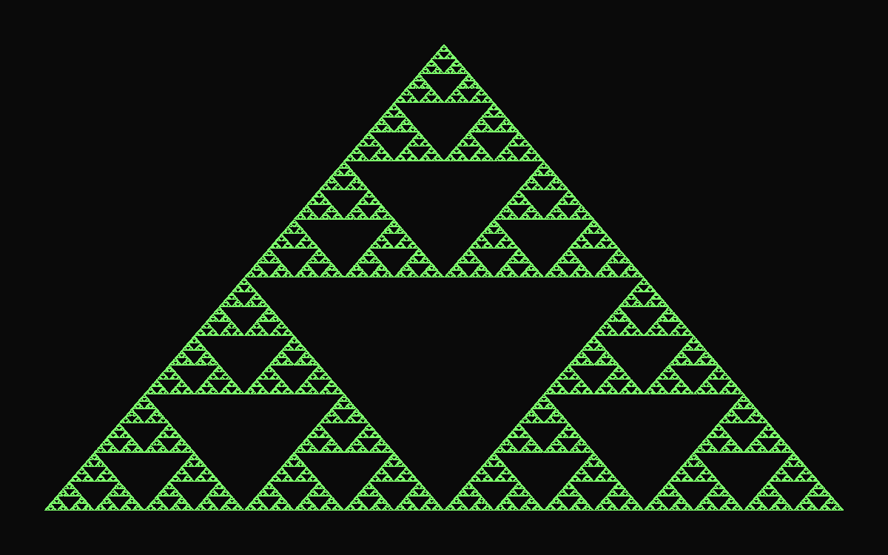
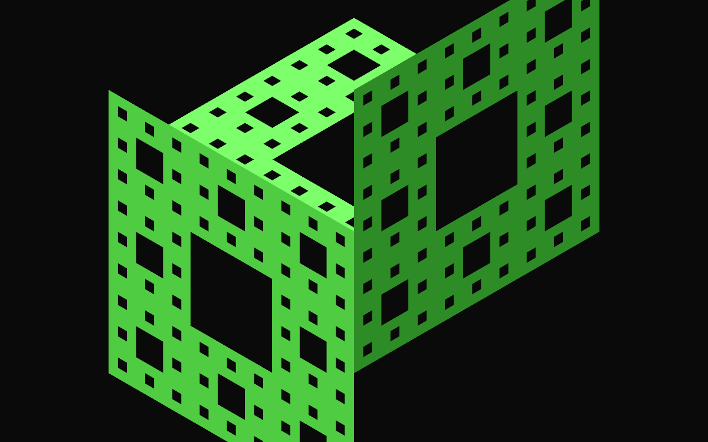
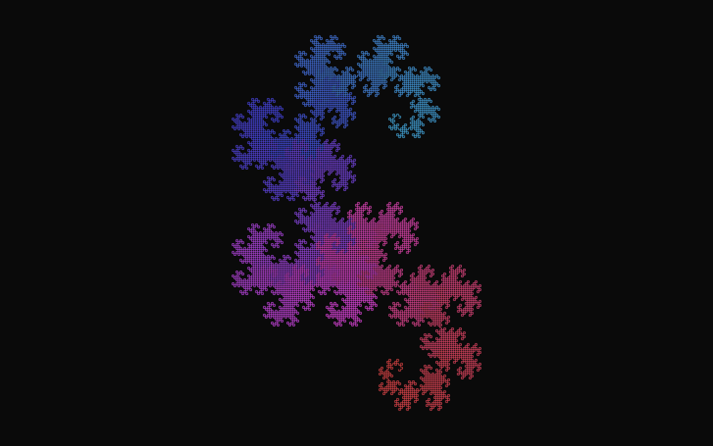
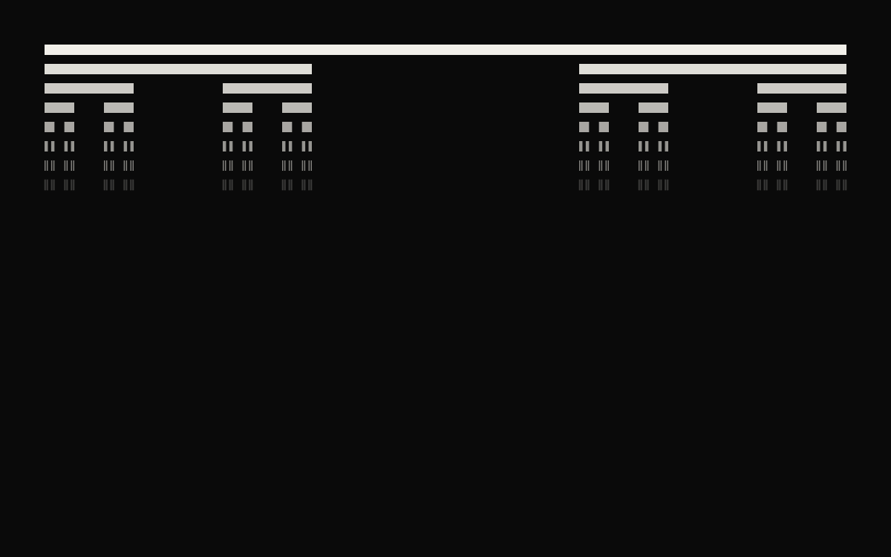
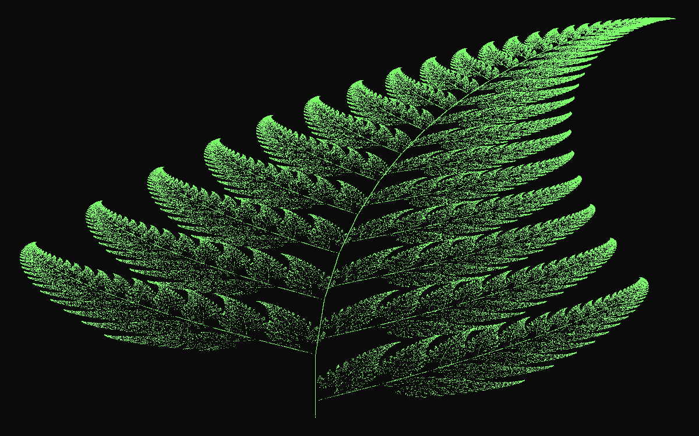
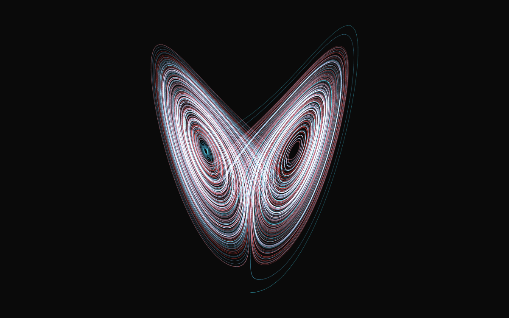
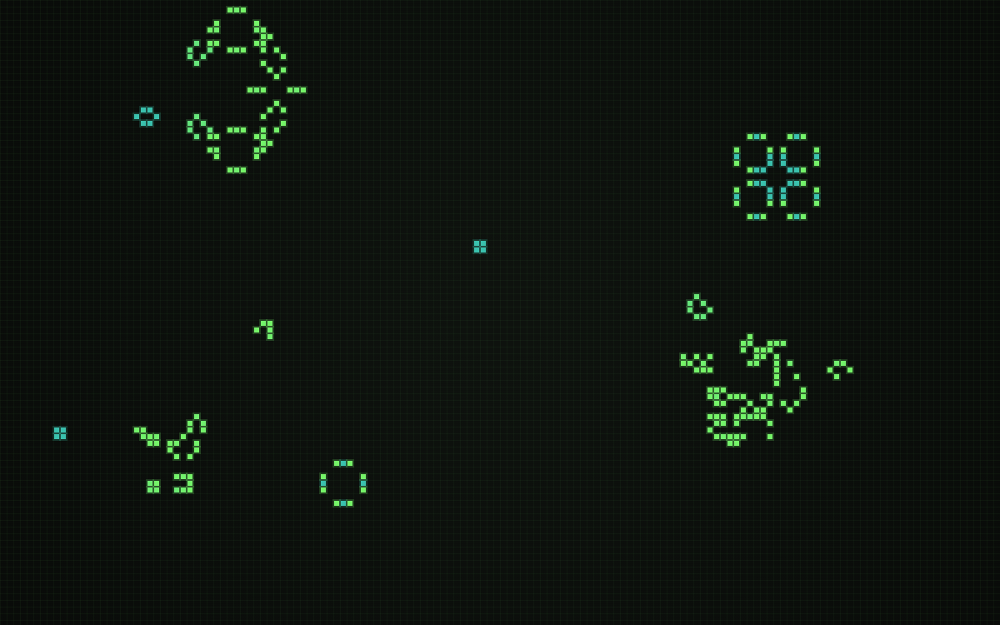

# Fractal Atlas

An interactive, browser-only explorer for twelve famous fractals — from
**Mandelbrot's infinite zoom** all the way down past 10²⁸, to **Conway's Game
of Life** running as a live cellular automaton. Each fractal has a short
**history & importance** dialog (formula, who discovered it, why it matters,
links to further reading).

No backend. No build step. Static HTML/CSS/JS — open the page and explore.



---

## What's in the Atlas

| | | |
|---|---|---|
|  **Mandelbrot set** — escape-time, infinite zoom (WebGPU deep-zoom engine) |  **Julia sets** — same engine, with an interactive c-picker |  **Burning Ship** — Mandelbrot's twisted cousin |
|  **Mandelbulb** — 3D escape-time, ray-marched |  **Sierpiński triangle** — chaos-game IFS |  **Menger sponge** — 3D recursive subdivision |
|  **Koch snowflake** — L-system curve |  **Dragon curve** — L-system unfolding |  **Cantor dust** — base-3 subdivision |
|  **Barnsley fern** — IFS chaos game |  **Lorenz attractor** — RK4-integrated 3-body ODE |  **Conway's Game of Life** — B3/S23 cellular automaton |

Each tile opens a dedicated explorer page; the **info `i`** button on every
tile (and inside every explorer) opens a popup with formula, history,
mathematical significance, and Wikipedia links.

---

## Highlights

- **WebGPU deep-zoom Mandelbrot/Julia engine** with perturbation theory,
  reference-orbit reuse, and bilinear-approximation acceleration. Pushes the
  browser zoom ceiling past **10²⁸** while staying interactive.
- **Mixed-precision math** — TD-f32 (mantissa + exponent), DD-f64
  (double-double), and QD-f64 (quad-double, ~62 digits) all implemented in
  JS + WGSL.
- **Julia integration** into the same engine: toggle `kind=julia`, the WGSL
  shader branches per-uniform, and the c-value is set with an in-page
  Mandelbrot **c-picker** (with a live orbit miniview showing the
  z := z² + c trajectory).
- **WebGPU + CPU fallback** on every fractal: each renderer tries GPU first,
  falls back silently to a Web-Worker CPU implementation if WebGPU is
  unavailable.
- **Adaptive depth** on L-systems and IFS — as you zoom in, Koch / Dragon
  recompute at higher recursion, Sierpiński / Barnsley raise the chaos-game
  iteration count.
- **Tunable runtime params** — escape radius and iteration cap exposed as
  live-update inputs on the Mandelbrot/Julia explorer.
- **Ice palette** matching the *icefractal.com* aesthetic, plus several
  classic palettes; all switchable via the toolbar or URL parameter.

---

## Run it locally

WebGPU requires a recent browser (Chrome 113+, Edge 113+, Safari 18+,
Firefox Nightly with `dom.webgpu.enabled=true`). Over `file://`, WebGPU is
blocked; serve over HTTP:

```sh
cd frontend
python3 -m http.server 8765
# then open http://localhost:8765
```

That's the entire dev loop — no `npm install`, no bundler, no watcher. ES
modules and CDN imports do all the work.

## Project layout

```
frontend/
  index.html              ← Atlas home (12 tiles)
  mandelbrot.html         ← Mandelbrot & Julia (WebGPU deep-zoom)
  fractal.html            ← Generic explorer for the other 10
  game-of-life.html       ← Conway's Game of Life
  main.js                 ← Mandelbrot/Julia engine (~6k lines)
  orbit-worker.js         ← Reference-orbit computation in a worker
  cpu-render-worker.js    ← CPU tile renderer (TD/DD/QD precision tiers)
  cpu-render-core.js      ← Shared CPU iteration core
  qd-f64.js               ← Quad-double float library (Bailey-Hida)
  assets/
    js/
      fractals.js         ← 12-fractal catalogue
      fractal-info.js     ← Info-modal content (history, formula, refs)
      fractal-viewer.js   ← Generic-page dive controller
      renderers/          ← One pair (cpu + gpu) per family
docs/                     ← README screenshots
```

## Deploy

Static files only — copy `frontend/` to any static host:

- Cloudflare Pages, Netlify, GitHub Pages, S3 + CloudFront, Vercel, nginx, …
- **HTTPS is required for WebGPU in production browsers.**

There is no backend, no API, no server-side state. Recording (when used) runs
entirely browser-side via WebCodecs.

## Tech notes

- All math primitives have unit tests against
  [Decimal.js](https://github.com/MikeMcl/decimal.js/) ground truth in
  `frontend/test-cpu-render.mjs`.
- Reference-orbit perturbation follows the Zhuoran rebase variant; deep-zoom
  precision is QD-f64 (~62 digits) on CPU, TD-f32 on GPU with DD-f64
  fallback at the deepest tier.
- Julia perturbation has its own rebase formula (the
  `w_new = (Z_curr + w_old) − Z_0` form, since Julia's reference start is
  non-zero — a fact that quietly bites everyone who tries to reuse a
  Mandelbrot perturbation pipeline).
- Per-fractal info content (history, formula, references) is hand-authored
  HTML in `assets/js/fractal-info.js` and rendered by the
  `window.showFractalInfo(id)` modal helper.

## Credits

Built with WebGPU, Web Workers, and a lot of escape-time iteration.

Mathematical content (formulas, biographical notes, dates) cross-checked
against Wikipedia at the time of writing; references are linked from the
info dialogs.

Fractals are not invented; they are discovered. This atlas just tries to
make a few more of them easy to wander into.
